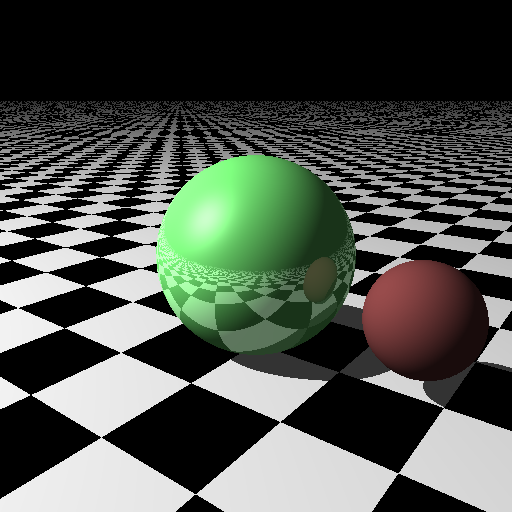
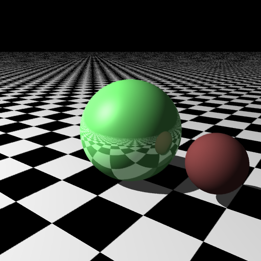
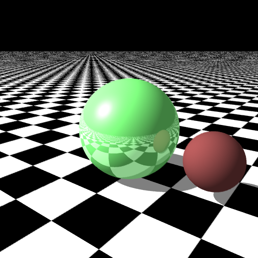
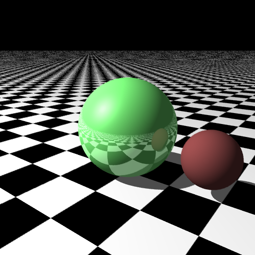
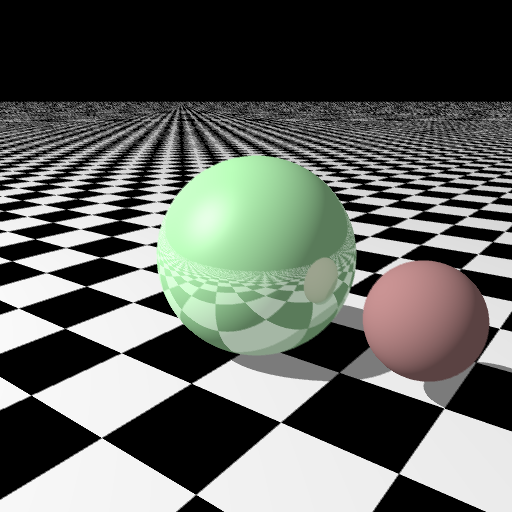

Bienvenue ! Ceci est une description du raytrace que j'ai développé dans le cadre du MOS 2.2 "Informatique Graphique" à l’École Centrale de Lyon - *Said Khaboud*

### Intorduction:

Pour le développement de ce raytracer je me suis basé sur le tutoriel dans [ce lien](http://www.slimeland.com/raytrace/help.html) afin d'éviter d'écrire le même code que le professeur M. Nicolas Bonneel.
Parmis les différences principales il y a:
-Vous remarquerez que je n'ai pas surchargé les opérateurs sur le vecteur, celà m'a aider à mieux gérer le code vu que je suis novice en c++.
-J'ai crée des différents headers pour chaque classe utilisé dans ce programme.
-J'ai utilisé des plans au lieu des sphères génates pour les murs.
Après les principes de base restent les mêmes et les calculs mathématiques ne sont pas modifiés bien sûr. Et pour faire imple j'ai traité le cas des brdfs diffuses et spéculaires.

### Le raytracer:

Premièrement j'ai commencé par la création des headers correspondant aux différentes classes que j'ai utilisé. Pour la classe couleur j'ai ajouté un 4ème paramètre "Special" qui détermine le facteur d'atténuation de la lumière lors de la diffusion sur une brdf diffuse s'il est entre 0 et 1. Si le paramètre Special est égale à 1 alors la surface est spéculaire, et la valeur 2 est réservé pour le carrelage du sol.
Ensuite le reste gu traitement étant le même, on a getColorAt qui renvoie la couleur dans le point correspondant, on a indexOfWinningObject qui renvoie l'indice dans la liste des objects de l'objet le plus proche du rayon généré soit à partir de la caméra Soit à partir d'un autre point.

|  | 
|:--:| 
| *Première image 512*512 sans aa.* |

Après, pour l'antialiasing, au lieu de générer les rayons aléatoirement suivant la loi normale, j'ai d'avord crée une variable aadepth qui détermine combien de fois on veut générer des rayons pour l'antialiasing, ensuite je loop deux fois sur cette valeur afin d'utiliser les indices pour générer les rayons directement à partir des points entourant le centre du pixel, une approche simple mais qui a bien amélioré le résultat.
|  | 
|:--:| 
| *Deuxième image 512*512 avec aa.* |

Ensuite, j'ai esayé de changer la variable ambient lighting utilisée pour scaler la couleur lors de l'appel de getColorAt(). 

|  |  |
|:--:| 
| *Ambient light = 0.5.* | *Ambient light = 0.3.* |

Après, j'ai tenté de rajouter la correction gamma aux couleurs, ce qui a donné le résultat suivant:

|  | 
|:--:| 
| *Image 512*512 avec aa et correction gamma.* |

On remarque donc que la simple modificationde l'ambient lighting permet d'avoir de bon résultats dans un temps d'exécution petit, une vingtaine de secondes.
Pour les perspectives, on peut rajouter les objets transparents et les sources de lumière étendues, voire même les milieux participants, améliorations parmi d'autres que je n'ai pas encore implémenter à cause des contraintes de temps et mon manque de connaissance en c++.
